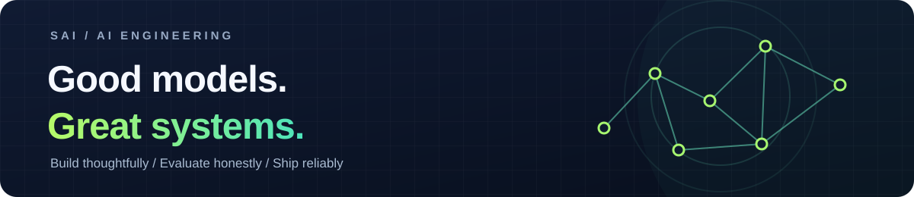

  

# Sai Krishna Manohar Balusu

**AI Engineer · Software, cloud & applied AI**

I build the engineering around AI that makes it useful: reliable backends, thoughtful product interfaces, and evaluations that show where a system succeeds or fails. My work spans 5+ years across software, cloud, and applied AI. I completed an M.S. in Data Intelligence & AI at the University of South Florida in 2026.

**[Explore my portfolio](https://saibalusu.com/)** · **[Connect on LinkedIn](https://www.linkedin.com/in/sai-krishna-manohar-balusu/)** · **[Email me](mailto:saikrishnamanohar@outlook.com)**

---

## Selected work

### 01 / [CricketOps](https://github.com/SaiBalusu-usf/CricketOps)

**Live scoring, resilient state, and broadcast graphics.** An event-sourced cricket platform that turns ball-by-ball events into live scorecards, OBS overlays, and a director view. Built with Node.js, PostgreSQL, Socket.IO, Docker, and WebRTC. Its repository runs 77 unit tests in CI.

### 02 / [AI-Com](https://github.com/SaiBalusu-usf/AI-Com)

**Cricket commentary with a fact-checking loop.** A graduate NLP research project with a structured-event pipeline, template baseline, slot-level faithfulness checker, adversarial regression cases, and reproducible evaluation harness. Current repository results use synthetic fixtures; pretrained and fine-tuned model comparisons are still pending.

### 03 / [Codex Live Lab](https://github.com/SaiBalusu-usf/codex-live-lab)

**An idea-to-evidence developer demo.** A Vite and Express web app that connects the OpenAI Responses API for product ideation with GitHub repository data for live project evidence.

---

## What I work with

| Focus | Tools and practices |
| --- | --- |
| **AI & evaluation** | Python, NLP pipelines, structured outputs, test harnesses, model evaluation |
| **Backend & data** | Node.js, TypeScript, PostgreSQL, REST APIs, Socket.IO |
| **Product & delivery** | React, Vite, Docker, CI, cloud engineering |

I like projects where the demo is useful **and** the limits are visible: a scoring event can be replayed, a generated sentence can be checked against its source, and a product claim can be traced to working code.

---

### Let's build something useful

For AI engineering, software, or research collaboration, reach me at **[saikrishnamanohar@outlook.com](mailto:saikrishnamanohar@outlook.com)**. You can also browse my [portfolio](https://saibalusu.com/) or [public repositories](https://github.com/SaiBalusu-usf?tab=repositories).
